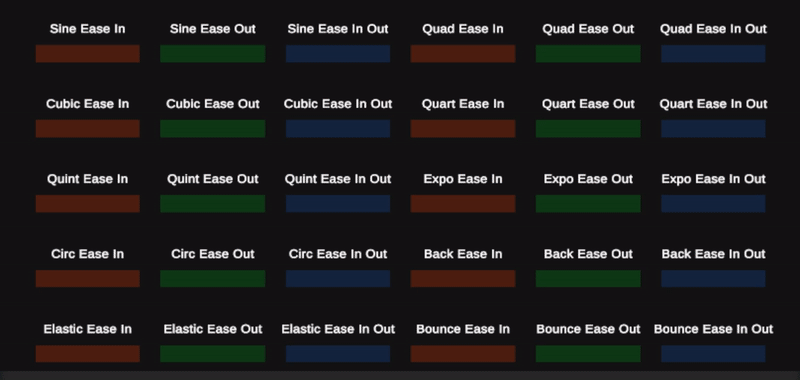
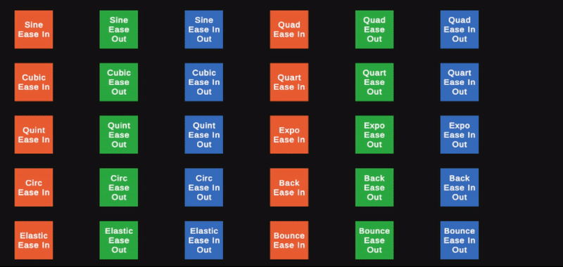
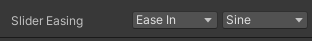

<h1>
    Collection of several ease functions for Unity
</h1>

> **Ease functions translated from https://easings.net/**

## Examples





## Inspector Drawer



## How To Use

Inspector Example:
```csharp
    public EaseFunction easeFunction;
    void Update()
    {
        slider.value = easeFunction.GetValue(Time.time);
    }
```
Static Example:
```csharp
    void Update()
    {
        slider.value = EaseFunction.EaseOutSine(Time.time);
    }
```